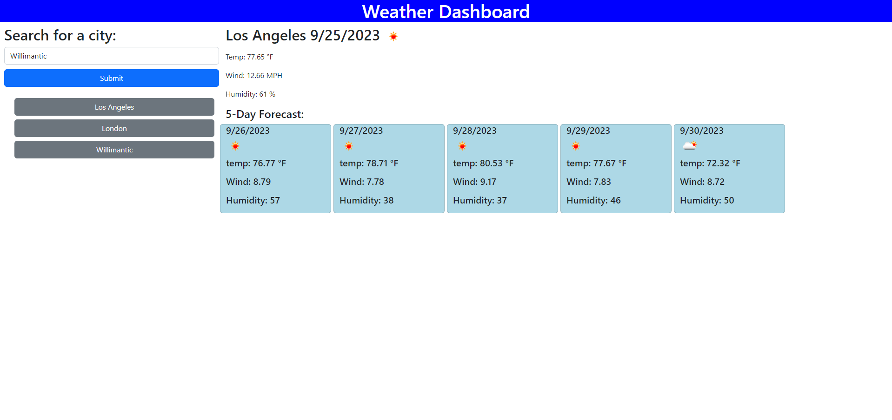

# weather-dashboard

## Description 

Weather dashboard that displays todays current weather and the 5 day forecast. Created with HTML, CSS, JS. It takes the city you type in and gives you the forecast for that city. saves searched cities in local storage and you can click those previous searches for quick look up of that city again.

## Installation

N/A

## Usage

Load up the website. Type in the city and you are presented with the weather of that city. Below that is the 5 day forecast with the icon showing sunny, cloudy, or rain. 

Click on previous searched cities on the history bar for quick look up of that city.

Preview:

Website:

https://salgonzalez151.github.io/weather-dashboard/

## License

N/A